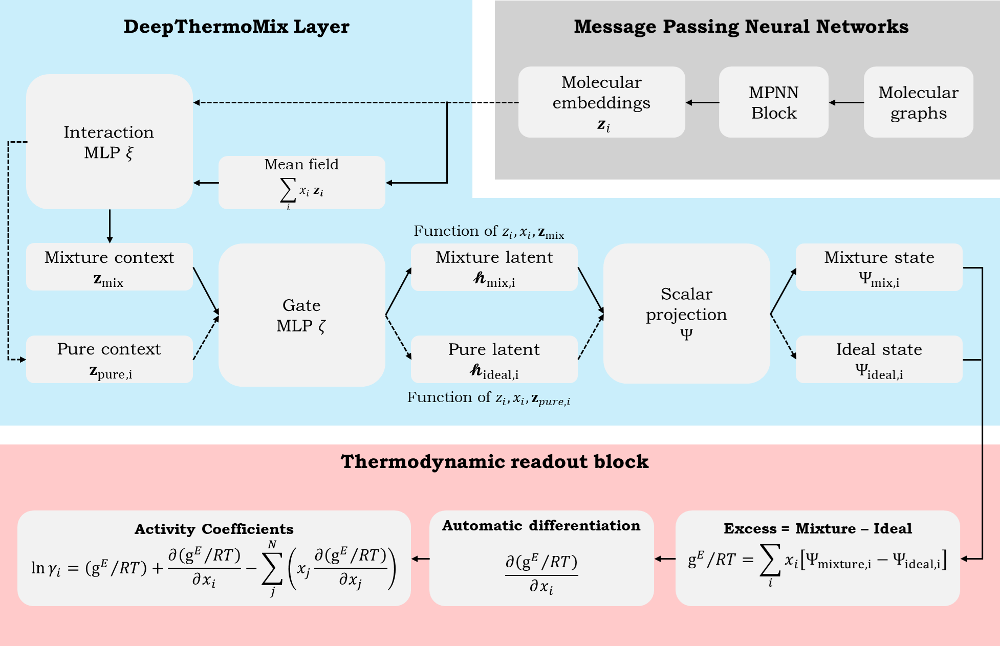

# **DeepThermoMix**

## **Project Overview**
DeepThermoMix is a thermodynamically consistent machine learning model designed to predict multicomponent activity coefficients across binary, ternary, and N-component mixtures.

**Paper**: [Link to the paper preprint](https://doi.org/10.26434/chemrxiv.10001495/v1)

**Documentation**: See [`docs/`](docs/) for comprehensive details:
- **[`docs/model.md`](docs/model.md)** — Neural network architecture, constraint modes, and loss functions
- **[`docs/data.md`](docs/data.md)** — Data pipeline and dataset splitting strategies
- **[`docs/train.md`](docs/train.md)** — Training workflow and hyperparameter optimization
- **[`docs/inference.md`](docs/inference.md)** — Prediction for binary, ternary, and N-component systems
- **[`docs/user_guide.md`](docs/user_guide.md)** — Tutorials and application examples

### **Core Concept**

The model builds upon the local-composition assumption found in classical thermodynamic models (e.g., Wilson, NRTL, UNIQUAC, UNIFAC). However, DeepThermoMix diverges from these traditional approaches by relaxing the explicit algebraic form of the intermolecular interaction expression.



### **Key Innovation**

Instead of relying on rigid functional forms such as Boltzmann-distribution-like functions used to encode pairwise molecular interactions, DeepThermoMix utilizes Message Passing Neural Networks (MPNNs) and Multi-Layer Perceptrons (MLPs) as universal function approximators. This allows the model to learn complex, non-linear interactions while maintaining core physical assumptions.

The architecture enforces thermodynamic consistency through three complementary modes:

| Mode | Behavior |
|------|----------|
| **'none'** | Direct prediction without constraints |
| **'soft'** | Penalty-based regularization via Gibbs-Duhem loss |
| **'hard'** | Physics-guaranteed consistency via automatic differentiation |

For detailed specifications, refer to [`docs/model.md`](docs/model.md).

### **Core Capabilities**
| Capability | Details |
|------|----------|
| **Component agnostic** | Accepts arbitrary components in binary, ternary, or N-component mixtures |
| **Permutation invariant** | Invariant to component ordering |
| **Linear complexity** | Computational cost scales as O(N) with mixture size |
| **Learnable mixing rule** | Non-linear learned mixing rule replacing rigid algebraic forms |
| **Flexible constraint modes** | Unconstrained, soft (penalty), or hard (guaranteed) thermodynamic enforcement |
| **Uncertainty quantification** | Ensemble-based prediction variance estimation |

### **Supported Predictions**
- **Binary VLE**: Phase equilibrium diagrams with pressure-composition-temperature calculations
- **Ternary systems**: Excess Gibbs energy surfaces on simplex coordinates
- **N-component mixtures**: Activity coefficients for arbitrary component counts
- **NIST integration**: Automatic saturation pressure retrieval via NIST WebBook API

See [`docs/inference.md`](docs/inference.md) and [`docs/user_guide.md`](docs/user_guide.md) for usage examples.

## **Project Environment**
### **Hardware specification**
    > CPU: Intel(R) Core(TM) i9-13900KF
    > GPU: NVIDIA RTX A4000 16 GB VRAM
    > RAM: 128 GB DDR5

### **Installation**

#### Automatic Installation (Recommended)
Run the installation script from the project root in an Anaconda Prompt (base environment):
```bash
python install.py
```
The script will prompt you to choose whether to install with CUDA-enabled GPU support or CPU only.

> **Which version should I choose?**  
> - **GPU support**: Recommended if you plan to train models or perform development work.  
> - **CPU only**   : Sufficient for inference and moderate-sized predictions without the overhead of CUDA dependencies.

**Note:** For GPU support, ensure you have the following prerequisites installed before running `install.py`:
1. NVIDIA driver
2. CUDA Toolkit (cu129)
3. cuDNN

#### Manual Installation
<details>
<summary>Click to expand manual installation steps</summary>

##### Step 1. Core requirements (GPU only)
1. Install NVIDIA driver
2. Install CUDA Toolkit (cu129)
3. Install cuDNN

##### Step 2. Library setup

**For GPU-support:**
```bash
conda create --name deepthermomix-gpu python=3.11
conda activate deepthermomix-gpu
pip install torch==2.8.0 torchvision==0.23.0 torchaudio==2.8.0 --index-url https://download.pytorch.org/whl/cu129
pip install torch_geometric
pip install pyg_lib torch_scatter torch_sparse torch_cluster torch_spline_conv -f https://data.pyg.org/whl/torch-2.8.0+cu129.html
conda install nomkl pandas matplotlib mpltern seaborn scikit-learn networkx rdkit jupyter ipykernel -c conda-forge -y
pip install optuna optuna-dashboard
```

**For CPU-only:**
```bash
conda create --name deepthermomix-cpu python=3.11
conda activate deepthermomix-cpu
pip install torch==2.8.0 torchvision==0.23.0 torchaudio==2.8.0
pip install torch_geometric
pip install pyg_lib torch_scatter torch_sparse torch_cluster torch_spline_conv -f https://data.pyg.org/whl/torch-2.8.0+cpu.html
conda install pandas nomkl matplotlib mpltern seaborn scikit-learn networkx rdkit jupyter ipykernel -c conda-forge -y
pip install optuna optuna-dashboard
```

</details>

---
### **Project Information**

#### Verified Environment & Build Versions
| Package              | Version / Status                |
|----------------------|---------------------------------|
| pandas               | 2.3.3                           |
| numpy                | 1.26.4                          |
| matplotlib           | 3.10.7                          |
| seaborn              | 0.13.2                          |
| sklearn              | 1.7.2                           |
| networkx             | 3.5                             |
| rdkit                | 2025.09.1                       |
| joblib               | 1.5.2                           |
| tqdm                 | 4.67.1                          |
| torch                | 2.8.0+cu129                     |
| torchvision          | 0.23.0+cu129                    |
| torchaudio           | 2.8.0+cu129                     |
| torch_geometric      | 2.7.0                           |
| pyg_lib              | 0.5.0+pt28cu129                 |
| torch_scatter        | 2.1.2+pt28cu129                 |
| torch_sparse         | 0.6.18+pt28cu129                |
| torch_cluster        | 1.6.3+pt28cu129                 |
| torch_spline_conv    | 1.2.2+pt28cu129                 |
| optuna               | 4.5.0                           |
| optuna_dashboard     | 0.19.0                          |
| jupyter              | Installed (no version attribute)|
| ipykernel            | 7.1.0                           |

#### PyTorch & CUDA Info

| Property             | Value             |
|----------------------|-------------------|
| Torch version        | 2.8.0+cu129       |
| CUDA available       | True              |
| CUDA version         | 12.9              |
| cuDNN version        | 91002             |
| GPU device count     | 1                 |
| Current GPU device   | NVIDIA RTX A4000  |

## **Citations**

Please also cite the following packages if used in your work:
- PyG
- RDKit